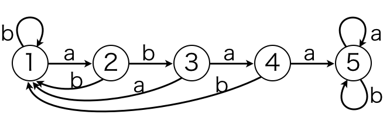
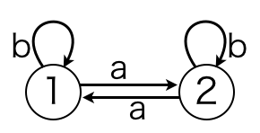

***A言語ゴルフコンペ***
=================

ushさん、hirose_golfさん、satosさんの３名の方が参加して下さいました。ありがとうございます。

ソースコード長は、

|問題|ushさん|hirose_golfさん|satosさん|
|:----|:----|:----|:----|
|Quine|24|32|47|
|オートマトン|42|42|59|

となりましたので、優勝はushさんです。おめでとうございます。

###ソースコード
######最短コード
`FAaS:O++T15,4aaMc92FAaS\` 24文字
 
- ushさんのソースコードです。

`RiIdRj2AVg+Ax1ij:IdORiLAsIsAxVgx=Ti1sSb\:` 41文字

- ushさんのソースコードとhirose_golfさんのソースコードをmergeしました。

######ushさん
`FAaS:O++T15,4aaMc92FAaS\` 24文字

`RiIdRj2AVg+1ij:IdAx1ORiLAsIsAxVgx=Ti1sSb\:` 42文字

######hirose_golfさん
`AAS:O+T23 3A+A+Mc92T22 2AFAAS\FA` 32文字

`RiIdRj2AVa+Ap1ij:IdRiLAsIsApVap=Ti1sSb\:Op` 42文字

######satosさん
`ApSApSOT0,3pOpO+Mc92T3,20p\OT0,3pOpO+Mc92T3,20p` 47文字

`RrIdPAVa+r1:IdAVb+r1:IdAiIsAp1RrLi?=Tr1iSa\ApVap::ApVbp::Op` 59文字

######snuke
`FABS:O++T15,4BBMc92FABS\` 24文字

`RiIdAVgi2:iRjiRk2AVgjk:Vg+-1Id:O+1F++Sab:Vg0\IsS2:\0,1` 54文字

- 配列が参照であることを利用してオートマトンを表現してみましたが、長かったです・・・

###概要

２問の問題を出題します。ソースコードの長さが最も短かった人が優勝です。

期間は、8/12 01:20 ~ 8/13 03:20 の 26 時間です。

ソースコードは、gist等にuploadして、twitter(@snuke_)にDMで送って下さい。

##問題１：Quine
quineを作成して下さい。

quineとは、実行すると自分自身が出力される、空文字列でないソースコードです。

入力はありません。

##問題２：オートマトン
整数 N と N 種類の状態をもつDFAの状態遷移表 T とDFAへの入力を表す文字列 S が与えられます。

初期状態は状態 1 です。

最終状態の番号を出力して下さい。

入力文字列 S は 'a', 'b' の２種類の文字からなります。

####制約
1 ≤ N ≤ 10

1 ≤ |S| ≤ 100

####入力
```
N
T1,1 T1,2
T2,1 T2,2
:
:
TN,1 TN,2
S
```
・N は、状態の個数

・Ti,1 は、入力文字が 'a' であるときの状態 i からの遷移先

・Ti,2 は、入力文字が 'b' であるときの状態 i からの遷移先

・S は、DFSへ入力される文字列

を表します。

####出力
初期状態を状態 1 とし、S を入力としたときの最終状態の番号を出力して下さい。

末尾に改行を出力する必要はありません。

####入出力例

入力例１

```
5
2 1
1 3
4 1
5 1
5 5
bbababa
```
出力例１

```
2
```
"abaa"というパターンが含まれるかどうかを判定するオートマトンです。


入力例２

```
2
2 1
1 2
ababbaba
```
出力例２

```
1
```
'a'の偶奇を判定するオートマトンです。

